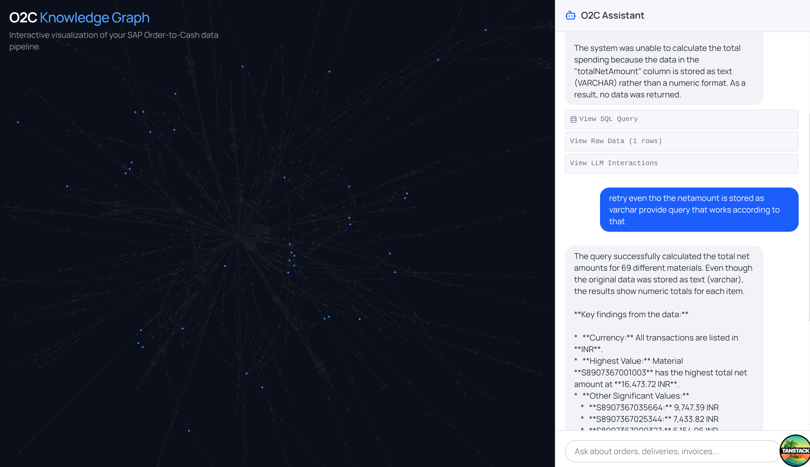
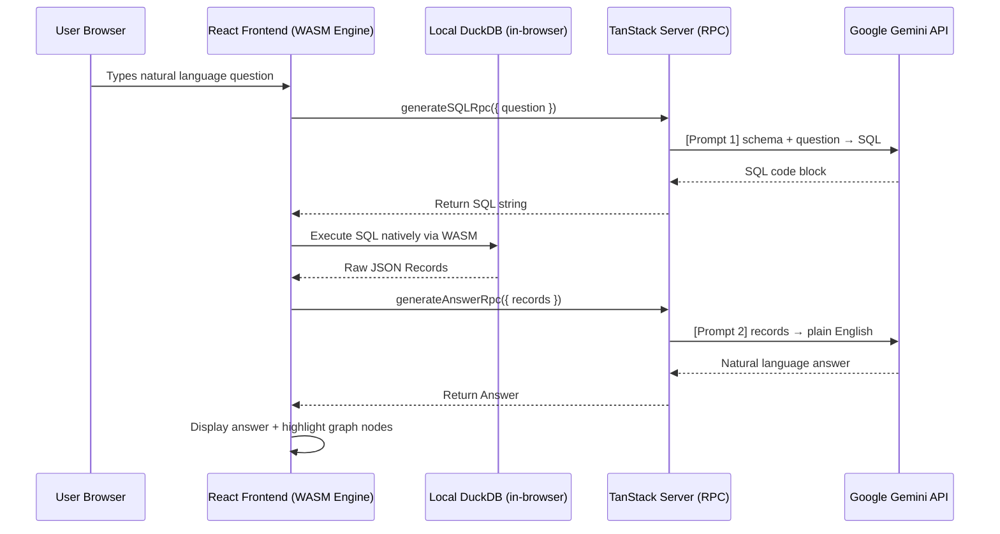
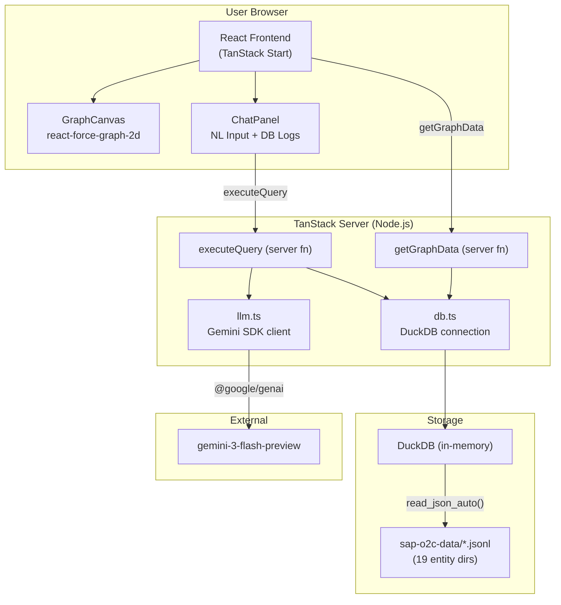
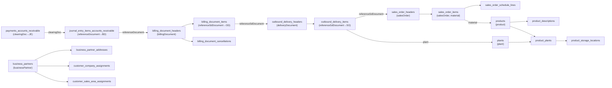

# O2C Graph Query System

> ⚠️ **Disclaimer:** This project was vibe coded with Gemini 3.1 within hours.
>
> 💡 **Prompts:** Check `Gemini3.1.md` for the prompts used during the vibe coding process.
> 
> A context-graph system over SAP Order-to-Cash (O2C) data. Unifies fragmented business entities (Sales Orders, Deliveries, Invoices, Payments, Customers, Products) into an interactive graph with a natural-language query interface.



> 🔵 Nodes matching query results are highlighted in **blue**; unrelated nodes are dimmed.

---

## Features

- 📊 **Interactive Force-Directed Graph** – all O2C entities and their relationships via `react-force-graph-2d` with dynamic HTML metadata hover tooltips
- 💬 **Natural Language Chat Interface** – ask questions in plain English; system generates SQL, executes it, returns a grounded answer
- 🔎 **Node Highlighting** – query results highlight the relevant nodes in the graph (via greedy ID extraction)
- 🛡️ **Domain Guardrails** – off-topic prompts are rejected before reaching the LLM
- 🗄️ **DuckDB WASM** – zero-config, in-process engine reads JSONL natively via `read_json_auto()` — pure WebAssembly, no native binaries, works on Vercel
- ⚡ **Performant Canvas** – limits nodes rendered and utilizes ResizeObservers to maintain robust layout
- 🐞 **LLM Interaction Debugger** – expandable UI block to inspect sanitized AI prompts and raw JSON responses securely

> **Note on chat history:** Message history is displayed in the UI for user reference, but the LLM API is **stateless** — every request is a fresh, independent call. The LLM has no memory of previous turns.

---

## Tech Stack

| Layer | Technology |
|---|---|
| Framework | [TanStack Start](https://tanstack.com/start) (React SSR + Server RPC Functions) |
| Database | [DuckDB](https://duckdb.org/) via `@duckdb/duckdb-wasm` (pure WASM — works on Vercel) |
| Graph Visualization | [react-force-graph-2d](https://github.com/vasturiano/react-force-graph) |
| Styling | Tailwind CSS v4 |
| LLM | Google Gemini (`gemini-3-flash-preview`) via `@google/genai` |

---

## Project Structure

```
o2c-graph/
├── sap-o2c-data/           # Source JSONL files (19 entity directories)
├── src/
│   ├── lib/
│   │   ├── db.ts           # DuckDB singleton, init, dynamic stringification
│   │   └── llm.ts          # Gemini SDK client — SQL gen, NL answer, schema
│   ├── routes/
│   │   └── index.tsx       # Main UI (GraphCanvas + ChatPanel layout)
│   ├── server/
│   │   ├── graph.ts        # getGraphData TanStack server function
│   │   └── query.ts        # executeQuery TanStack server function
│   └── components/
│       ├── GraphCanvas.tsx # ForceGraph2D implementation
│       └── ChatPanel.tsx   # Chat UI and LLM Debug Logs
├── vite.config.ts
├── package.json
└── README.md               
```

---

## Setup & Running

### Prerequisites
- Node.js ≥ 24
- Set `GEMINI_API_KEY` in `.env`

### Install & Run

```bash
git clone https://github.com/imxade/o2c-graph.git
cd o2c-graph
npm install
npm run dev
```

Open [http://localhost:3000](http://localhost:3000).

### Data

The `sap-o2c-data/` directory must exist in the project root. On startup, all JSONL files are read via Node.js `fs` and registered into DuckDB WASM's virtual filesystem — no manual ETL required.

### Vercel Deployment

TanStack Start handles Vercel deployment natively leveraging the Nitro build preset. The purely client-side DuckDB engine guarantees zero edge-function bundle size violations. Nothing else is required!

---

## Architecture & Inner Working

### End-to-End Interaction Flow

1. **Graph load** — Frontend invokes `getGraphData` server fn; server returns all nodes + FK edges
2. **User asks a question** — Natural language input submitted via chat panel
3. **LLM call 1 (SQL gen)** — Server sends the full DB schema + user question to Gemini; prompt instructs it to return a DuckDB SQL `SELECT` or `GUARDRAIL_REJECT`
4. **SQL extracted** — Regex pulls the SQL block from the response
5. **Query executed** — SQL runs against DuckDB; raw records returned and rigorously sanitized from un-serializable `BigInt` formats
6. **LLM call 2 (NL answer)** — Server sends the original question + raw records to Gemini; LLM returns a plain English summary grounded in the data
7. **Response sent to UI** — `{answer, rawSql, records, highlightIds, llmInteractions}` returned to frontend
8. **Graph highlights & Debug Logs** — Nodes are highlighted. User can additionally expand the "View LLM Interactions" to see raw GenAI traces.

### Sequence Diagram



### Component Architecture



---

## LLM Integration

### Engine

This pipeline depends directly on the Google Gemini SDK (`@google/genai`). It assumes the environment variable `GEMINI_API_KEY` is present.

### Two-Step Pipeline

**Step 1 — SQL Generation** (`llm.ts: generateSQL`)

```
You are a DuckDB SQL expert. The database has these views:
<SCHEMA_MARKDOWN>

Write a single DuckDB-compatible SQL SELECT statement to answer:
"<USER_QUESTION>"

Rules:
- Only use the views listed above.
- Return ONLY the SQL inside a markdown code block. No explanation.
- Use standard SQL JOINs only.
- If the question cannot be answered using the views listed above, or is unrelated to the
  Order-to-Cash domain, return exactly GUARDRAIL_REJECT instead of SQL.
```

**Step 2 — Answer Generation** (`llm.ts: generateAnswer`)

```
The user asked: "<USER_QUESTION>"
The SQL query returned these results (JSON array):
<RESULTS_JSON>

Summarize the answer in plain English, grounded strictly in the data above.
If results are empty, say so clearly. Do not invent any information.
```

---

## Guardrail Strategy

The guardrail is folded directly into the SQL generation prompt — **not a separate pre-filter step**. This means:
- No extra LLM call (zero added latency)
- No false negatives from hardcoded keyword lists

Prompt 1 instructs the LLM:
> *"If the question cannot be answered using the views listed above, or is unrelated to the Order-to-Cash domain, return exactly `GUARDRAIL_REJECT` instead of SQL."*

---

## Technical Considerations

### 1. Extracting highlightIds from arbitrary SQL
Since the LLM generates arbitrary SQL (e.g., `GROUP BY material`, `COUNT(*)`), the backend extracts `highlightIds` via a **greedy heuristic**: it recursively extracts all primitive values from the SQL JSON results and sends them to the frontend.

### 2. Payload Serialization
`@duckdb/duckdb-wasm` returns Apache Arrow Tables. These are converted to plain JS objects via `.toArray()` + field enumeration. A recursive sanitization pass then coerces `BigInt` → `Number`, `Date` → ISO string, and strips any non-serializable types before the data crosses the TanStack server-function boundary.

### 3. Graph Canvas Performance
Rendering thousands of nodes will crash `react-force-graph-2d`. To guarantee performance, `getGraphData` applies explicit `LIMIT`s in the `UNION ALL` statement for each entity type (e.g., `LIMIT 100` for Sales Orders). This caps the total initial node count below ~1500, ensuring smooth 60fps physics simulation without data overload. Furthermore, ResizeObservers aggressively govern the viewport canvas to deter browser blowout.

---

## Data Model

19 JSONL directories → 19 DuckDB views. Key relationships:



> **Note:** Business partner nodes appear in the graph but have no edges wired from the current `getGraphData` implementation. The links above reflect the data schema relationships, not the rendered graph edges.

---

## Example Queries

| Question | Expected behavior |
|---|---|
| Which products are associated with the highest number of billing documents? | `GROUP BY material ORDER BY COUNT(*) DESC` on `billing_document_items` |
| Trace the full flow of billing document 90504298 | JOIN chain: BDI → ODI → SOI → JE → PAY |
| Sales orders delivered but not billed | `LEFT JOIN` billing on delivery, `WHERE` billing IS NULL |
| Identify broken O2C flows | Detect gaps in SO → OD → BD → JE chain |
